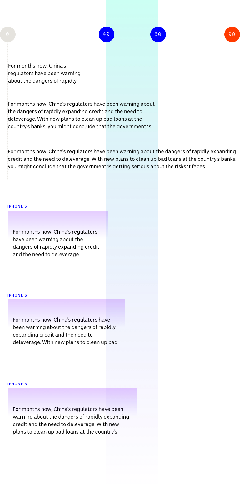

## Benchmarks

The optimal line length for your body text is considered to be 50-60 characters per line, including spaces.

**Too wide** – if a line of text is too long the reader’s eyes will have a hard time focusing on the text. This is because the line length makes it difficult to gauge where the line starts and ends. Furthermore it can be difficult to continue onto the correct line in large blocks of text.

**Too narrow** – if a line is too short the eye will have to travel back too often, breaking the reader’s rhythm. Too short lines also tend to stress readers, making them begin on the next line before finishing the current one (hence skipping potentially important words).

