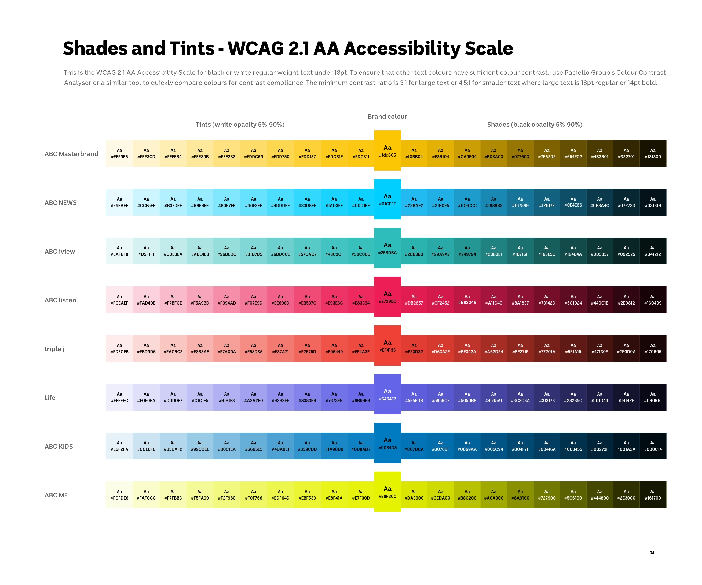

> "The power of the web is in its universality. Access by everyone regardless of disability is an essential aspect."
> ##### Tim Berners-Lee, W3C Director and inventor of the World Wide Web

## Colour guides

The ABC applies strict colour guidelines to all digital platforms, to ensure all content is accessible to all audiences. See [Accessible colour guides](#)

## Web Accessibility Perspectives

Watch these videos to learn more about how improvements in digital accessibility are essential for some, but helpful for everyone.

## Colour contrast

The ABC applies strict colour guidelines to all digital platforms, to ensure all content is accessible to all audiences.

