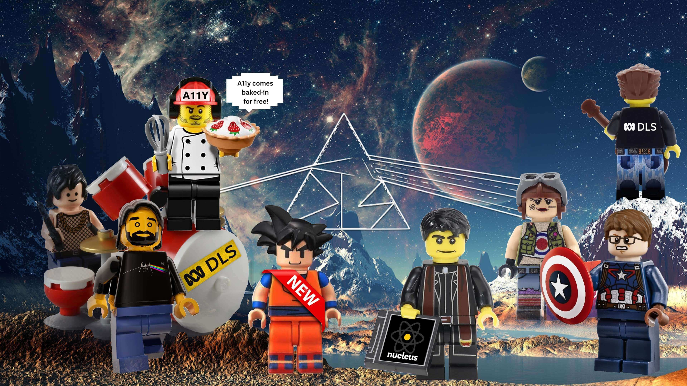

## What is the DLS

The Design Language System (DLS) serves as a tool to design for the web and native apps. The purpose of this system is to ensure a coherent functionality, visual identity and language, along with the most common usability and accessibility aspects. The DLS helps to ensure coherence both inside an product and between separate products for all ABC digital products across platforms.

The DLS is not the same as the brand guidelines. However, the DLS provides best practices examples on how to coherently use the brand attributes to apply a unified visual identity system across the ABC digital properties.

The DLS is not meant to be read, but used. It is an ever-evolving manual for building blocks across all ABC digital properties that everyone across the organisation should follow.

## Who is the DLS for?

The DLS provides elements, instructions and resources that can be used for product design by designers, product managers and developers. The system reduces the need to develop solutions to each design problem independently. However, this system does not cover specific product design solutions but offers building blocks from which to build the applications.

You can use the DLS to find the practices you need, but combining the elements and building the product based on them is altogether a separate design process.

## What DLS resources are available?

The intermediate solution is that the DLS resources is collected, maintained and updated in [shared libraries](http://www.google.com) available as Sketch files. Our future goal is to move towards a DLS website.

## Contact us 

The DLS is maintained by the DLS team in the ABC Enterprise Design team. You can contact us by email or via the #dls channel in Slack.

### We are

- Adam Jesson
- Karen Wong
- Francisco Flores
- Kayne Chu

